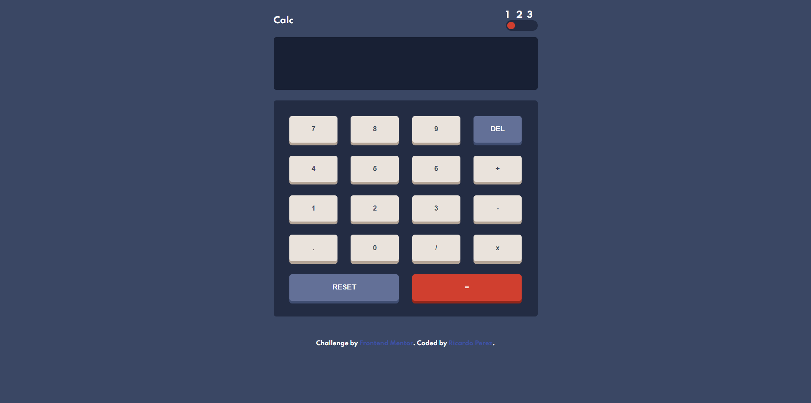

# Frontend Mentor - Calculator app solution

This is a solution to the [Calculator app challenge on Frontend Mentor](https://www.frontendmentor.io/challenges/calculator-app-9lteq5N29). Frontend Mentor challenges help you improve your coding skills by building realistic projects. 
## Overview

### The challenge

Users should be able to:

- See the size of the elements adjust based on their device's screen size
- Perform mathmatical operations like addition, subtraction, multiplication, and division
- Adjust the color theme based on their preference
- **Bonus**: Have their initial theme preference checked using `prefers-color-scheme` and have any additional changes saved in the browser

### Screenshot




### Links

- Live Site URL: [Live demo](https://rick1196.github.io/basic-calculator/)

## Run this project locally
Install gulp cli
```
  npm install --global gulp-cli
```

Install dependencies
```
  npm install
```

## My process

The process for this chanllange was quite easy

- First i builded three sections, header, screen and pad buttons
- Then into the styles file i builded a grid template for those three sections and then the grid template for the pad buttons
- The las step was add the calculator functionality and the toggler theme functionality with vanilla JS

### Built with

- Vanilla js
- Sass
  - Flex box
  - grid
- Gulp


### What I learned

Whit this challenge i improved my css skills, but i need more practice to write cleaner css and html code

## Author

- Website - [Ricardo Perez](https://github.com/Rick1196)
- Frontend Mentor - [@Rick1196](https://www.frontendmentor.io/profile/Rick1196)
- Twitter - [@ricardo111196](https://twitter.com/ricardo111196)
